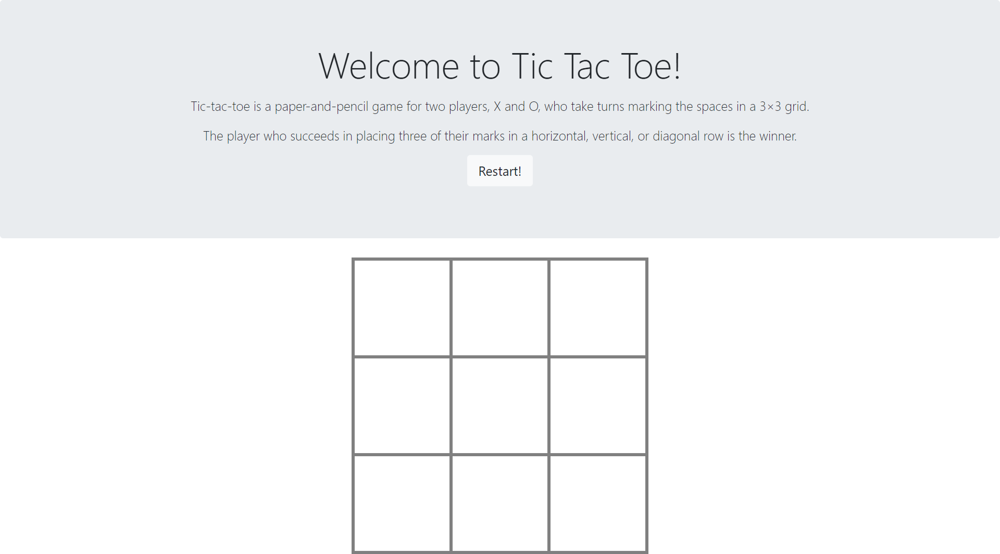

# Tic Tac Toe!란?

Udemy의 Python and Django Full Stack Web Developer Bootcamp 강의 중 DOM과정의 결과물입니다.

3*3의 정사각형인 판에 두 사람이 번갈아 표시를 하고, 가로 혹은 세로 혹은 대각선으로 3개가 이어지면 이깁니다.

(아직 자동으로 게임을 종료하는 시스템은 아닙니다. 업데이트 예정.)

# Tic Tac Toe!

